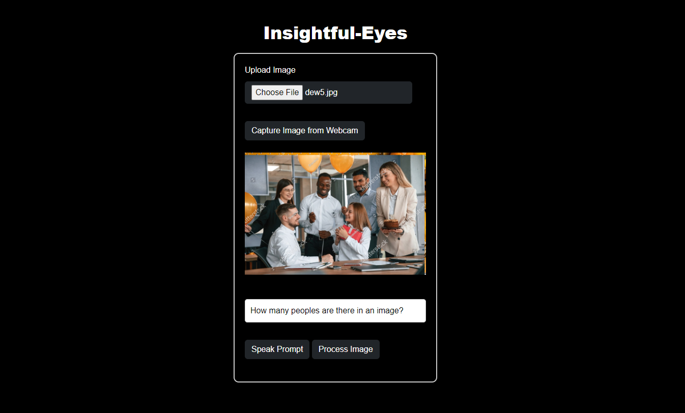

# Insightful-Eyes

Insightful-Eyes is a powerful, groundbreaking LLM-powered guide designed to illuminate the world around you. Whether you're exploring historical landmarks, admiring vintage cars, examining intriguing objects, or observing beautiful houses, our innovative platform provides insightful explanations for everything you see. Unlock the stories behind the sights with our intelligent and intuitive guide, making every observation a rich and educational experience. Insightful-Eyes is designed to be a useful tool for the blind, aiding in exploration and understanding. It also serves as a learning aid for children, helping them verify formulas and explore their surroundings.
<br>
<br>



# Benefits of Insightful-Eyes: Use Case Perspective
### 1. Assistance for the Visually Impaired
  - **Daily Navigation:** Insightful-Eyes provides real-time descriptions of surroundings, helping visually impaired individuals navigate safely and independently in unfamiliar environments.
  - **Object Recognition:** Quickly identify objects, such as identifying the correct bus at a stop, distinguishing between similar items, or reading labels and signs.
  - **Accessibility:** Facilitates participation in activities that require visual recognition, such as reading menus in restaurants or identifying products in stores.
### 2. Educational Tool for Children
  - **Learning Aid:** Helps children verify mathematical formulas, understand scientific diagrams, and gain deeper insights into their study materials.
  - **Interactive Learning:** Makes learning interactive and engaging by providing detailed explanations and context for various objects and phenomena.
  - **Exploration and Curiosity:** Encourages curiosity by allowing children to ask questions about their surroundings and receive informative answers.
### 3. Exploration and Tourism
  - **Historical Landmarks:** Provides detailed information and historical context about landmarks, enhancing the experience for tourists and history enthusiasts.
  - **Museum Visits:** Offers in-depth explanations of exhibits, artworks, and artifacts, making museum visits more educational and engaging.
  - **Travel Companion:** Acts as a virtual tour guide, offering insights about new places, cultures, and attractions.
### 4. Real-Time Video Captioning
  - **Event Participation:** Enables real-time captioning of events, such as sports games, concerts, and conferences, ensuring users don’t miss any details.
  - **Daily Activities:** Assists in everyday activities, such as cooking by providing step-by-step instructions or giving real-time feedback during DIY projects.
  - **Live Translation:** Provides real-time translation of signs, menus, and other written content in foreign languages, aiding travelers and expatriates.
### 5. Support for Seniors
  - **Safety and Independence:** Helps seniors navigate their environments safely by identifying potential hazards and providing real-time guidance.
  - **Medication Management:**- Assists in identifying medications and reading prescriptions, ensuring correct usage and dosage.
  - **Daily Tasks:** Aids in everyday tasks such as shopping, cooking, and reading mail, promoting independence and confidence.
### 6. Aiding Hobbyists and Enthusiasts
  - **Collectors and Enthusiasts:** Provides detailed information about collectibles, vintage cars, rare coins, and other hobby-related items, enriching the hobby experience.
  - **Nature Exploration:** Assists nature enthusiasts in identifying plants, animals, and geological features during hikes and outdoor activities.
  - **Photography and Art:** Offers insights and background information about artistic subjects, enhancing the creative process and appreciation of art.
### 7. Enhancing Professional Tasks
  - **Field Work:** Assists professionals such as archaeologists, geologists, and biologists by providing on-the-spot information and context during fieldwork.
  - **Construction and Maintenance:** Helps workers identify tools, materials, and follow safety guidelines, improving efficiency and safety.
  - **Healthcare:** Assists healthcare professionals by identifying medical instruments, reading patient records, and providing information on procedures.
### 8. Improving Shopping Experience
  - **Product Information:** Provides detailed descriptions, reviews, and comparisons of products in stores, helping users make informed purchasing decisions.
  - **Price Comparison:** Assists in comparing prices of similar products across different stores, ensuring the best deals.
  - **Online Shopping:** Enhances the online shopping experience by identifying products in images and videos, and providing relevant information and purchasing options.
### 9. Supporting Creative Projects
  - **DIY Projects:** Guides users through DIY projects by identifying tools, materials, and providing step-by-step instructions.
  - **Art and Craft:** Assists in identifying art supplies, reading patterns, and following craft instructions, making creative projects more accessible and enjoyable.
  - **Interior Design:** Helps users visualize and identify furniture, decor items, and design elements, aiding in interior decoration and design projects.
# Technical Stack
### Backend
- **Framework:** FastAPI
- **Authentication:** JWT (JSON Web Tokens)
- **Large Language Models:** Google Gemini Vision model (Large Language Model)
- **API Documentation:** Swagger UI and Redoc
- **Deployment:** AWS EC2 Instance
- **Containerization:** Docker
- **Container Registry:** Amazon Elastic Container Registry (ECR)
- **CI/CD:** GitHub Actions for automated testing, validation, and deployment
- **Testing:** Automated unit testing and integration testing
### Frontend
- **Languages:** HTML, CSS, JavaScript
- **Framework/Library:** jQuery
- **Responsive Design:** Bootstrap
### Infrastructure
- **Cloud Platform:** Amazon Web Services (AWS)
- **Services:** EC2 (Elastic Compute Cloud), ECR (Elastic Container Registry)
- **Security:** AWS Identity and Access Management (IAM), Security Groups, VPC (Virtual Private Cloud)
### Development Tools
- **Version Control:** Git, GitHub
- **IDE:** Visual Studio Code
- **Collaboration:** GitHub Issues, Pull Requests

# Installation
### Clone the repository to your designated path
```bash
git clone https://github.com/MANMEET75/Insightful-Eyes.git
```
### Navigate to that specific directory
```bash
cd Insightful-Eyes/
```
### Create an environment using Anaconda
```bash
conda create -p venv python==3.11 -y
```
### Activate the Anaconda environment
```bash
conda activate venv/
```
### Open your IDE
```bash
code .
```
### Install all the requirements
```bash
pip install -r requirements.txt
```
### Run the FastAPI Python backend
```bash
uvicorn main:app --reload --port 3000
```
### Navigate to the following URL for the user interface
```bash
http://localhost:3000/
```
### Navigate to the following URL to open the Swagger API interface.
```bash
http://localhost:3000/docs
```
### Navigate to the following URL to open the customized ReDoc HTML
```bash
http://localhost:3000/redoc
```
# Contributing
We welcome contributions to Insightful-Eyes! To contribute, follow these steps:

1. Fork the repository and clone it to your local machine.
2. Create a new branch for your feature **(git checkout -b feature/my-feature)**.
3. Commit your changes **(git commit -am 'Add new feature')**.
4. Push to the branch **(git push origin feature/my-feature)**.
5. Open a pull request with a detailed description of the changes.

## License
Insightful-Eyes is licensed under the MIT License. See the LICENSE file for more details.
#### Enjoy Coding!

